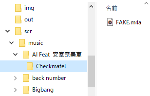

# Editing_ID3_tags

## 目的

家族のiTunesなし古いiPod nanoから楽曲データを取り出してみたらID3タグ情報がなかったため追加する  
要望により出力ディレクトリ構造を[CD名/曲名.拡張子]にする  

## 方法

古のソフト,pod野郎をつかい以下の構成となるよう取り出した  
おそらくこうなっているはず  
歌手名/CD名/曲名.拡張子  
CD名がなしときは[不明なアルバム]とする  
  
~~mutagenを使いタグ情報を付与する(["Pythonでmp3などのID3タグを編集するmutagenの使い方"](https://note.nkmk.me/python-mutagen-mp3-id3/))~~  
AIFFをうまく読み込んでくれないので方法を変える  
ディレクトリ構造を変更しBOM付きののテキストファイルを出力する  
["mp3tags"](https://www.mp3tag.de/en/)を使う  
["mp3tagsのMenu Convert > Text file - Tag機能"](https://help.mp3tag.de/main_converter.html#tff)を使用する
